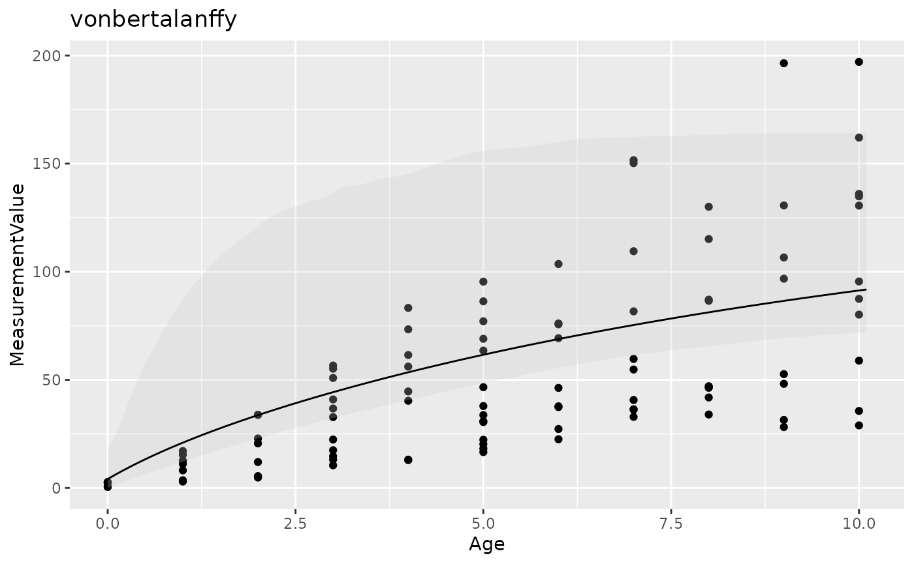
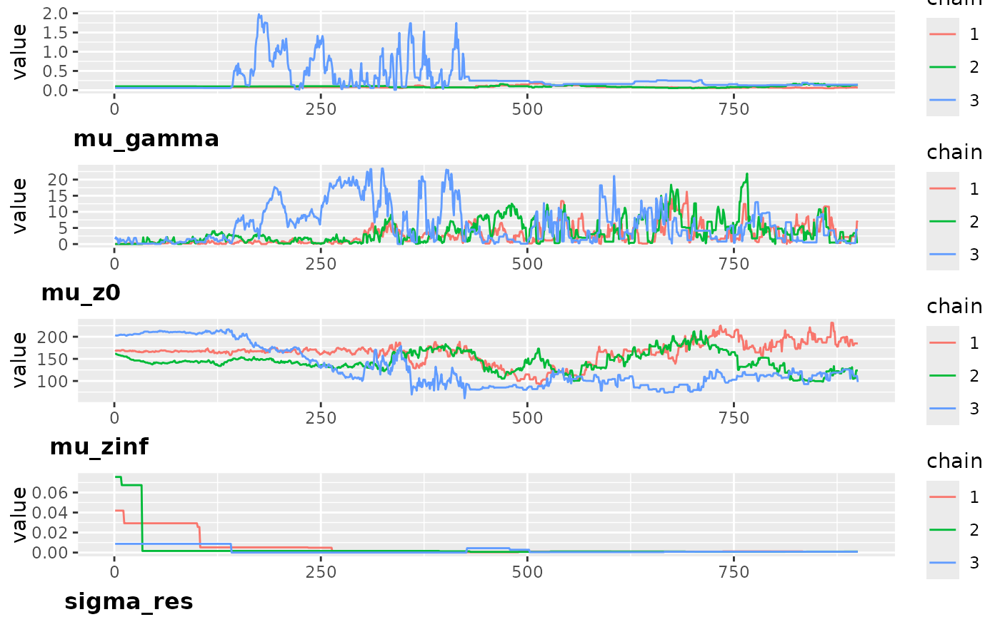

# run growth models

``` r
library(Growth)
```

##### Install `nimble`

If you never used the package `nimble`, you first need to install it
following recommendations [here](https://r-nimble.org/download)

## Run a single model

The function [`Gro_run()`](../reference/Gro_run.md) allows to run one
growth model. This function takes as arguments:

- `x` the index of the formula to use
- `dat` including at least the numeric columns *Age*, *MeasurementValue*
  and *AnimalAnonID*
- `all_mods` a vector of model names. The following models are supported
  : logistic, gompertz, tpgm, power, richards, vonbertalanffy.
- `random` list of the model names giving the parameters that should be
  included an individual random effect
- `run`: a list of Bayesian parameters including `nch` number of chains,
  `nthin` interval between iterations to keep, `nburnin` number of
  iterations to discard and `niter` total number of iterations. The
  default number of iterations is too small and need to be increased to
  reach convergence.

Only the model of index `x` will be used to run the model.

The function returns:

- `model` a list including estimates of coefficients and model
  characteristics
- `tab` a data frame with information on model wAIC

``` r
age <- rnorm(10000, 0, 1)
id1 =  rnorm(21,0, 0.5)
id2 =  rnorm(21,0, 0.4)
id3 =  rnorm(21,0, 0.3)
IND =sample(c(1:20), 100, replace = TRUE)
z <- 0.2+ id1[IND]+ (15 + id2[IND])* (1 - exp(-(1+ id3[IND]) * age)) +
  rnorm(100, 0, 0.01)
dat = data.frame(age = age, z = z, 
                 IND = as.numeric(factor(IND ,labels = c(1:length(unique(IND)))))
)

#Run a vonbertalanffy model including an individual effect on z0
out = Gro_run(1, 
              dat,
              all_mods  = c("vonbertalanffy"),
              random = c("z0"),
              run = list(nit = 500, nburnin = 100, nthin = 10, nch = 3))
#> nimble version 1.3.0 is loaded.
#> For more information on NIMBLE and a User Manual,
#> please visit https://R-nimble.org.
#> 
#> Note for advanced users who have written their own MCMC samplers:
#>   As of version 0.13.0, NIMBLE's protocol for handling posterior
#>   predictive nodes has changed in a way that could affect user-defined
#>   samplers in some situations. Please see Section 15.5.1 of the User Manual.
#> 
#> Attaching package: 'nimble'
#> The following object is masked from 'package:stats':
#> 
#>     simulate
#> The following object is masked from 'package:base':
#> 
#>     declare
#> |-------------|-------------|-------------|-------------|
#> |-------------------------------------------------------|
#> |-------------|-------------|-------------|-------------|
#> |-------------------------------------------------------|
#> |-------------|-------------|-------------|-------------|
#> |-------------------------------------------------------|
#>   [Warning] There are 1210 individual pWAIC values that are greater than 0.4. This may indicate that the WAIC estimate is unstable (Vehtari et al., 2017), at least in cases without grouping of data nodes or multivariate data nodes.
out$tab
#>       model_type random index Nparam     WAIC      lppd
#> 1 vonbertalanffy     z0     1      7 18831697 -35990.98
```

## Growth analysis: run multiple models

This function fits a series of growth models to a dataset, and select
the best one by wAIC. It takes as arguments:

- data_weight including at least the numeric columns *Age*,
  *MeasurementValue* and *AnimalAnonID*
- all_mods indicating the growth models that need to be fit.The
  following models are supported : logistic, gompertz, tpgm, power,
  richards, vonbertalanffy. default = “vonBertalanffy”
- `random` list of the model names giving the parameters that should
  include an individual random effect. See the example

``` r
Age <- sample(c(0:10), 1000, replace = TRUE)
MeasurementValue <- exp(0.2+15 * (1 - exp(-(0.1) * log(Age+1)))+ rnorm(1000,0,0.01))-1 
AnimalAnonID <- sample(c(0:20), 100, replace = TRUE)
dat = data.frame(Age = Age, MeasurementValue = MeasurementValue, 
                 AnimalAnonID = AnimalAnonID, MeasurementType = "Live Weight")

#Test 4 models: vonbertalanffy including an individual random effect on z0
#               vonbertalanffy including individual random effects on z0 and zinf
#               gompertz including an individual random effect on gamma 
#               gompertz including no individual random effect
a = Gro_analysis(dat, all_mods  = c("vonbertalanffy", "gompertz"),
                 random = list(vonbertalanffy = c("z0", "z0, zinf"), gompertz = c("gamma", "")),
                 run = list(nit = 1000, nburnin = 100, nthin = 1, nch = 1))
#>  * parallel has been set to FALSE, please wait more !
#> |-------------|-------------|-------------|-------------|
#> |-------------------------------------------------------|
#>   [Warning] There are 1 individual pWAIC values that are greater than 0.4. This may indicate that the WAIC estimate is unstable (Vehtari et al., 2017), at least in cases without grouping of data nodes or multivariate data nodes.
#> |-------------|-------------|-------------|-------------|
#> |-------------------------------------------------------|
#>   [Warning] There are 2 individual pWAIC values that are greater than 0.4. This may indicate that the WAIC estimate is unstable (Vehtari et al., 2017), at least in cases without grouping of data nodes or multivariate data nodes.
#> |-------------|-------------|-------------|-------------|
#> |-------------------------------------------------------|
#>   [Warning] There are 33 individual pWAIC values that are greater than 0.4. This may indicate that the WAIC estimate is unstable (Vehtari et al., 2017), at least in cases without grouping of data nodes or multivariate data nodes.
#> |-------------|-------------|-------------|-------------|
#> |-------------------------------------------------------|
```

## Growth Model Setting

This function gets the parameter and equations for the growth model and
takes as arguments:

- `data`, a data frame including at least the numeric columns *age*, *z*
  and *IND*
- `random` name of the parameters that must include an individual random
  effect
- `mod` Name of the model to fit. The following models are supported :
  logistic, gompertz, tpgm, power, richards, vonbertalanffy.

``` r
age <- rnorm(100, 0, 1)
z <- 0.2+ 15 * (1 - exp(-(1) * age)) +rnorm(100, 0, 0.01)
dat = data.frame(age = age, z = z,IND =sample(c(0:20), 100, replace = TRUE)
)
model <- Gro_ModSettings(data = dat, mod = "vonbertalanffy")
```

## Plot model prediction

This function gives the predicted values of the model and plots to check
the convergence of the model. It takes as arguments:

- `data` including at least the numeric columns *Age*,
  *MeasurementValue* and *AnimalAnonID*
- `out` result output named `model` from Gro_run() or from
  Gro\$analysis()

It returns the following object:

*`summary`shomwing mean, standard deviation, credible interval at 95%
and the Gelman-Rubin statistics Rhat of each parameter.* `predictions`
giving the mean estimates and credible interval at 95% of each age
`GOF`: 4 tests of goodness of fit: “normal”: test if residuals are
normally distributes ; “X”; test if there is a trend between residual
and Age, “var”: Test if there is the trend in the variance of the
residuals over Age ,“conv”: check if all Rhat \< 1.1 \* `plot_pred` Plot
of the predicted values, credible interval at 95% in grey and data
points. \* `convergence`: Plots of the Bayesian chains \* `posterior`:
Plots of the posterior distribution for each parameter

``` r
Age <- sample(c(0:10), 100, replace = TRUE)
AnimalAnonID <- sample(c(0:20), 100, replace = TRUE)
MeasurementValue <- exp(0.2+15 * (1 - exp(-(0.1) * log(Age+1)))+ 
                          rnorm(100,0,0.01) + AnimalAnonID*0.1)-1 
dat = data.frame(Age = Age, MeasurementValue = MeasurementValue, 
                 AnimalAnonID = AnimalAnonID, MeasurementType = "Live Weight")

out = Gro_analysis(dat, 
                   all_mods = c("vonbertalanffy"),
                   run = list(nit = 1000, nburnin = 100, nthin = 1, nch = 3))
#>  * parallel has been set to FALSE, please wait more !
#> |-------------|-------------|-------------|-------------|
#> |-------------------------------------------------------|
#> |-------------|-------------|-------------|-------------|
#> |-------------------------------------------------------|
#> |-------------|-------------|-------------|-------------|
#> |-------------------------------------------------------|
#>   [Warning] There are 88 individual pWAIC values that are greater than 0.4. This may indicate that the WAIC estimate is unstable (Vehtari et al., 2017), at least in cases without grouping of data nodes or multivariate data nodes.

p <- Gro_pred(data = dat, 
              out = out$model, 
              title =out$wAIC_tab$model[1])
#> Registered S3 methods overwritten by 'ggpp':
#>   method                  from   
#>   heightDetails.titleGrob ggplot2
#>   widthDetails.titleGrob  ggplot2
p$summary
#>                   mean          sd       QI 2.5      QI 97.5     Rhat
#> mu_gamma  7.608254e-02  0.02689827 3.436972e-02   0.12994073 1.449363
#> mu_z0     2.357651e+00  2.82616140 1.842070e-02   9.81688657 1.067070
#> mu_zinf   1.870152e+02 53.50979304 1.165386e+02 312.84787536 1.385989
#> sigma_res 7.110652e-03  0.01486939 2.997295e-04   0.07523896 2.769497
p$predictions
#> # A tibble: 102 × 4
#>      Age  mean Conf_Int_low Conf_Int_up
#>    <dbl> <dbl>        <dbl>       <dbl>
#>  1   0    2.36       0.0184        9.82
#>  2   0.1  3.64       1.36         10.9 
#>  3   0.2  4.91       2.65         12.0 
#>  4   0.3  6.17       3.89         13.2 
#>  5   0.4  7.42       5.06         14.4 
#>  6   0.5  8.66       6.19         15.7 
#>  7   0.6  9.89       7.29         17.1 
#>  8   0.7 11.1        8.42         18.2 
#>  9   0.8 12.3        9.51         19.4 
#> 10   0.9 13.5       10.6          20.5 
#> # ℹ 92 more rows
p$GOF
#> $normal
#> [1] TRUE
#> 
#> $X
#> [1] TRUE
#> 
#> $var
#> [1] TRUE
#> 
#> $conv
#> [1] FALSE
p$plot_pred
```



``` r
p$convergence
```



``` r
p$posterior
```


