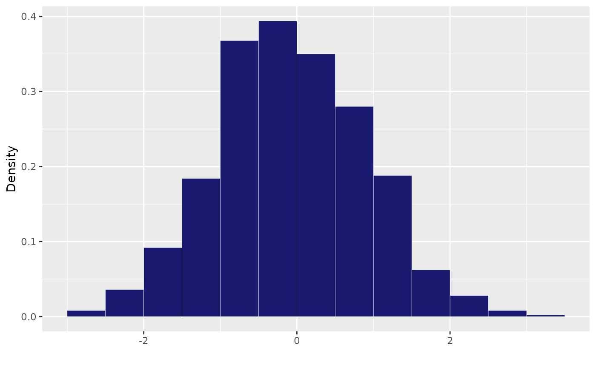

# Useful Functions

``` r
library(Growth)
```

This vignette presents a collection of useful functions used in the main
functions of this package to run nimble models and get simplified
outputs. They usually do not need to be run on their own.

### Manipulate nimble outputs

#### Estimate Rhat values

The function [`Rhatfun()`](../reference/Rhatfun.md) allows to take
outputs of nimble chains and to estimate Rubin Gelman convergence
statistics.

``` r
rb = array(rnorm(15*3*4), dim = c(15,3,4))
Rhatfun(rb, nch = 3, it = 15, nparam = 4)
#> [1] 1.0206915 0.9709333 0.9400075 0.9679284
```

#### Summary

The function [`sum_nim()`](../reference/sum_nim.md) makes a summary
table with main statistics for each parameter from output chains of a
Bayesian model

``` r
rb = array(rnorm(15*3*4), dim = c(15,3,4))
sum_nim(rb, nch = 3)
#>          mean       sd    QI 2.5  QI 97.5      Rhat
#> 1  0.09619219 1.157270 -2.024822 2.507279 1.0841636
#> 2 -0.11454537 1.006133 -1.674106 1.459683 0.9758006
#> 3  0.18182322 1.098268 -1.796275 2.098465 0.9530246
#> 4  0.26837835 1.033190 -1.467862 2.060732 1.0475169
```

### Histogram for posterior distribution

The function [`hist_post()`](../reference/hist_post.md) prepares a
histogram ggplot for posterior distribution of a given parameter. It can
be used within codes for plotting grids of posterior distributions of
several parameters. It takes a numeric vector `x` as argument.

``` r
hist_post(rnorm(1000))
#> Registered S3 methods overwritten by 'ggpp':
#>   method                  from   
#>   heightDetails.titleGrob ggplot2
#>   widthDetails.titleGrob  ggplot2
```



### Plots for convergence

The function [`conv_plot()`](../reference/conv_plot.md) prepares a
ggplot to loog at convergence of posterior distribution of a given
parameter. It takes a numeric vector `x` as argument and `m` the number
of iteration.

``` r
conv_plot(rnorm(1500), m =500)
```


## Write nimble codes

The function
[`Gro_writenimblecode()`](../reference/Gro_writenimblecode.md) writes a
nimble code for a growth model including individual random effect. It
takes as argument:

- `params` names of all parameters of the model.
- `model` likelihood of the nimble model
- `random` name of the parameters that must include an individual random
  effect
- `maxval` list including the maximum values for prior for each
  parameter
- `minval` list including the minimum values for prior for each
  parameter

``` r
#Example for a von bertalanffy model
Gro_writenimblecode(params = c('z0', 'zinf', 'gamma'), 
                    model = "for (j in 1:N){{
       logz[j] ~dnorm(z0[IND[j]] + zinf[IND[j]] * 
       (1 - exp(- gamma[IND[j]] * logx[j])), sigma_res)}}",
                    random = "gamma",
                    maxval = list(z0 = 5), 
                    minval= list(z0 = 0, zinf = 0, gamma = 0)
)
#> expression(sigma_res ~ dunif(0, 150), mu_z0 ~ dunif(0, 5), for (i in 1:Nind) {
#>     z0[i] <- mu_z0
#> }, mu_zinf ~ dunif(0, 1000), for (i in 1:Nind) {
#>     zinf[i] <- mu_zinf
#> }, mu_gamma ~ dunif(0, 1000), sigma_gamma ~ dunif(0, 150), for (i in 1:Nind) {
#>     gamma[i] ~ dnorm(mu_gamma, sd = sigma_gamma)
#> }, for (j in 1:N) {
#>     {
#>         logz[j] ~ dnorm(z0[IND[j]] + zinf[IND[j]] * (1 - exp(-gamma[IND[j]] * 
#>             logx[j])), sigma_res)
#>     }
#> })
```
